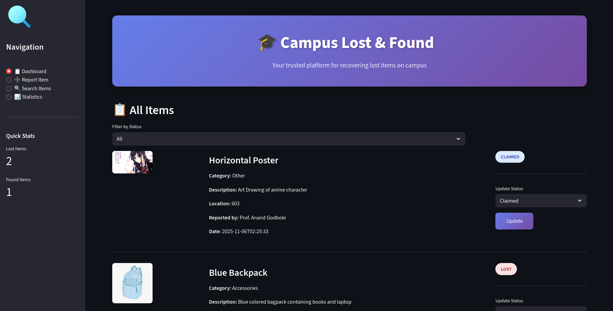
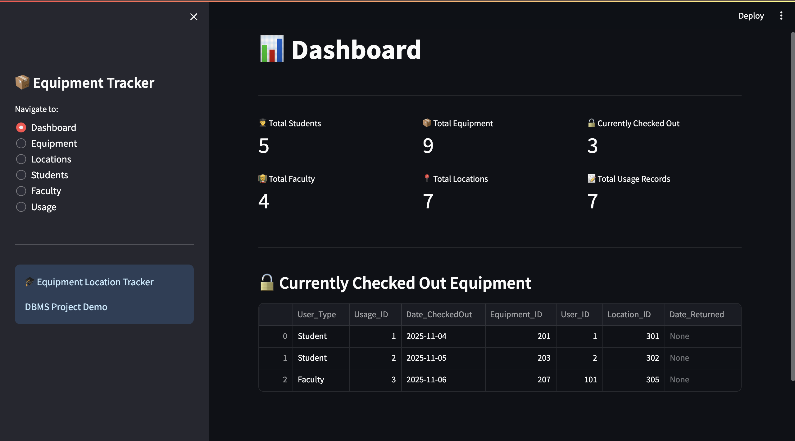
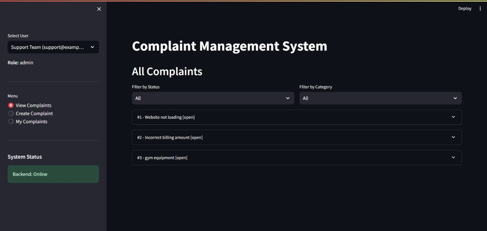

# Campus-Management-Portal
# 🏫 Campus Resource Management System

A unified web-based platform designed to streamline campus operations by integrating **Lost & Found**, **Equipment Tracking**, and **Complaint Management** modules.  
This project was built as part of our **DBMS Final Project** using **FastAPI**, **MySQL**, and a simple **Streamlit**.

---

## 🚀 Overview

The Campus Resource Management System helps students and administrators manage essential campus activities:

- 📦 **Lost & Found System** – Report lost items or register found ones. Admins can verify and return items.  
- ⚙️ **Equipment Tracker** – Track equipment usage, borrowing, and returns within the campus.  
- 🧾 **Complaint Management** – Students and staff can file complaints which are then handled by administrators.

All three modules share a **common login system** and a **centralized MySQL database**.

---

## 👥 Team Members & Roles

| Member | Module | Responsibilities |
|--------|---------|------------------|
| **Raj Kale** | 🟢 Lost & Found System | Backend (FastAPI), Database Design, API Integration |
| **Abhimanyu Kadhane** | ⚙️ Equipment Tracker | Backend (FastAPI), Equipment APIs, Frontend |
| **Vandan Jethwa** | 🧾 Complaint Management | Backend (FastAPI), Complaint APIs, Frontend |

---
##  Preview:
# Lost and Found:


# Equipment Tracker:


# Complaint Management:

---

## 🧠 Tech Stack

| Component | Technology |
|------------|-------------|
| **Backend** | [FastAPI](https://fastapi.tiangolo.com/) |
| **Database** | MySQL with SQLAlchemy ORM |
| **Frontend** | Streamlit |
| **Authentication** | JWT-based login system |
| **Server** | Uvicorn |

---

## 🗄️ Database Design (Overview)

The system uses a shared `users` table and separate tables for each module.

### 🔹 Lost & Found
- `users(user_id, name, email, password, role)`
- `lost_items(item_id, user_id, item_name, description, date_lost, location_lost, status)`
- `found_items(found_id, user_id, item_name, description, date_found, location_found, matched_item_id)`

### 🔹 Equipment Tracker
- `equipments(equip_id, name, type, location, condition, availability)`
- `borrow_records(record_id, equip_id, user_id, borrow_date, return_date, status)`

### 🔹 Complaint Management
- `complaints(complaint_id, user_id, title, description, category, date_filed, status)`
- `admin_actions(action_id, complaint_id, admin_id, notes, date_action)`

---


## ⚙️ Setup Instructions

### 1. Clone the Repository
```bash
git clone https://github.com/elritardato/campus-mgmt.git
cd campus-mgmt
```

### 2. Open two separate terminals, navigate to frontend and backend in each.
```bash
cd ~/campus-mgmt/frontend
```

```bash
cd ~/campus-mgmt/backend
```

### 3. Activate venv and install dependencies
```bash
python -m venv venv
source venv/vin/activate
pip install -r requirements.txt
```

### 5. Create a database for the website
```bash
CREATE DATABASE lost_found_db;
```

### 6. Create a USER and your own **.env** file
```bash
CREATE USER 'dashboard_user'@'localhost' IDENTIFIED BY 'StrongPass123!';
GRANT ALL PRIVILEGES ON lost_found_db.* TO 'dashboard_user'@'localhost';
FLUSH PRIVILEGES;
```

### 7. Go back to your backend folder and run the setup for database
```bash
mysql -u dashboard_user -p lost_found_db < setup_database.sql
```

### 8. Run frontend and backend in respective terminals
```bash
streamlit run app.py
uvicorn app:main --reload
```
---

## Directory tree:
```bash
campus_management_system/
│
├── README.md                       
├── .env.example                       
├── .gitignore                         
│
├── lost_found/                      
│   ├── backend/
│   │   ├── __init__.py
│   │   ├── main.py
│   │   ├── models.py
│   │   ├── database.py
│   │   ├── schemas.py
│   │   ├── crud.py
│   │   ├── setup_database.sql
│   │   └── requirements.txt
│   │
│   └── frontend/
│       ├── app.py
│       └── requirements.txt
│
└── equipment_tracker/                 
    ├── backend/
    │   ├── main.py
    │   ├── models.py
    │   ├── database.py
    │   ├── sample_data.py
    │   ├── requirements.txt
    │   └── equipment_tracker.db
    │
    └── frontend/
        ├── streamlit_app.py
        └── requirements.txt        
```


A website should open up in your browser. You can monitor the database using MariaDB or MySQL home server, depending on your system.

This project would have been possible without the help of our DBMS professor.


